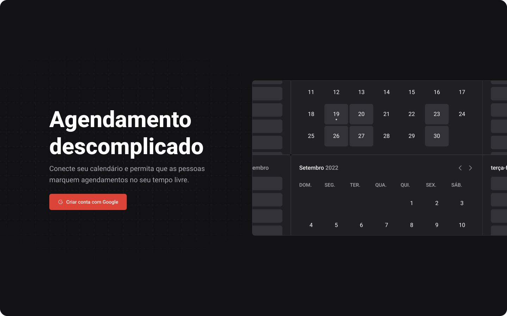

<h1 align="center">
  Ignite Call
</h1> 

<h2 align="center">Link to site online: <a href="https://ignite-call-diaspd.vercel.app/" target="_blank">Ignite Call</a> </h2>

<div align="center">
  <b>
    <a href="#-Technologies"><b>Technologies</b></a>&nbsp;&nbsp;&nbsp;|&nbsp;&nbsp;&nbsp;
    <a href="#-Project"><b>Project</b></a>&nbsp;&nbsp;&nbsp;|&nbsp;&nbsp;&nbsp;
    <a href="#-Layout"><b>Layout</b></a>&nbsp;&nbsp;&nbsp;
  </b>  
</div>

---

<div align="center">
  
</div> 

</br>

## 🚀 Getting started

Clone the project and access the folder.

```bash
$ git clone https://github.com/diaspd/ignite-call.git
$ cd 
```

## Installation

```bash
$ npm install
```

## Running the app

```bash
$ npm run dev
```

## Setting the app
To connect to Stripe you will need to create a `.env.local` file and add 

```
# your database URL using for example docker
- DATABASE_URL=https://localhost:3306

# and 2 keys for Google:
- GOOGLE_CLIENT_ID
- GOOGLE_CLIENT_SECRET

# and a random number for 
- NEXTAUTH_SECRET
```


The app will be available on `http://localhost:3000`

<br></br>

## 💻 Technologies

This project was developed with the following technologies:
<b>
- React
- Next 
- Stitches
- Oath
</b>

</br>

## 📄 Project
💰 .

<br></br>

## 🔖 Layout
- [Ignite Call - Figma](https://www.figma.com/community/file/1161274296921389678)

<br></br>

Made with ♥ by Pedro Dias. 👋 Follow me on social media! </br>

If you can give a little star, I appreciate it 🤩
